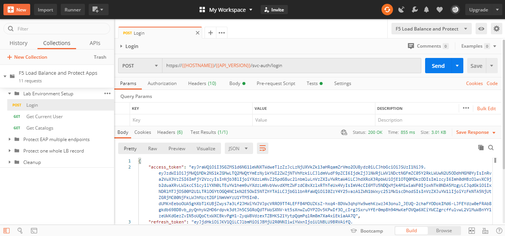
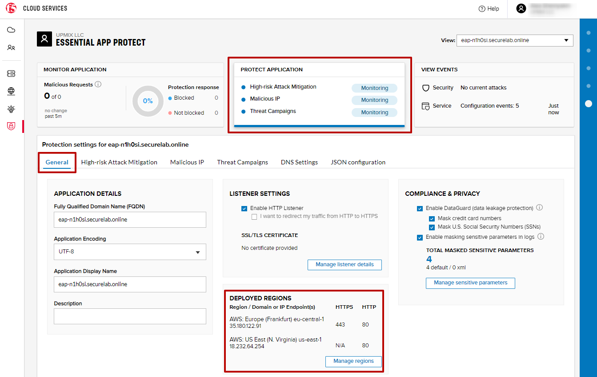
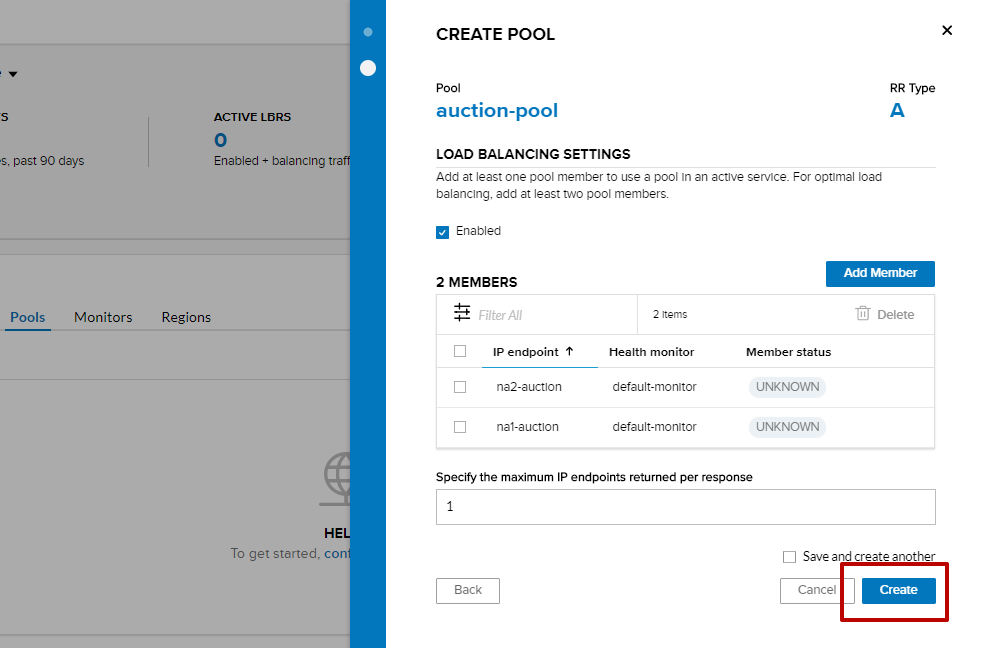

LAB: F5 Load Balance and Protect Apps
===========================================

.. contents:: Table of Contents

Pre-Requisites
###############

- Any modern browser: for working with the UI (and this document)
- Postman: for working with the API of the F5 Cloud Services

**IMPORTANT NOTE**: If you originally signed up for F5 Cloud Services through a Limited User invitation (such as an email invite from another lab or from a different account owner), then it is possible that you haven't yet completed a full registration.

You can quickly tell if you have a full account by looking at your account(s) in the `F5 Cloud Services Portal <https://portal.cloudservices.f5.com/>`_. If you do not see any "Accounts you own:" and only see "Accounts you've been granted access to" as a **"Limited User"**, then you will need to create a full account & update user info before you can proceed with this lab. You can do so in the step 3(c) below via the F5 Cloud Services API using the Postman request titled "Set User Info (optional)", the details of which are outlined below after the Login.

Lab Environment Overview
###############################

1. APIs and Services
*********************

This Lab utilizes a *Lab Service API*, which was custom-built just for executing this lab:

* **Lab service API**: facilitates auxiliary functions for the lab only: creating DNS entries, sending targeted requests & traffic to the apps/services, etc.

Lab Environment Setup
###############################

1. F5 Cloud Services Portal
***************************

`a)` Login

In order to use F5 Essential App Protect and DNS Load Balancer cloud services, you need access to F5 Cloud Services and be logged in with a valid user account. If you need to sign up, or if you already have one, proceed to the `F5 Cloud Services portal <http://bit.ly/f5csreg>`_.

.. figure:: _figures/0_1.png

Once you've logged in with an account, you will be using the user name and password values in the lab to authenticate with the F5 Cloud Services and the API.

`b)` Subscribe to Catalogs

In order to access specific F5 Cloud Services, you need to subscribe to the corresponding service catalogs. The focus of this lab is on F5 Essential App Protect and DNS Load Balancer services, so you will need to subscribe to them. At the time of subscribing, you can take an advantage of a 15-day free trial offer to work with F5 Essential App Protect service -- no payment method required!

   `1.` Click on the **Your F5 Cloud** tab in the left navigation panel and you will see the available service catalogs, as well as services you have subscribed to, if any. For this lab you will need to subscribe to **DNS Load Balancer** and **Essential App Protect services**.

   .. figure:: _figures/0_2.png

   `2.` You can subscribe to the service, or start a free trial (if available). For full subscription you will need to provide payment information in the **Accounts** - **Payments** section, by adding a credit card, or alternatively subscribing through AWS Marketplace.

   .. figure:: _figures/0_3.png

   After successfully subscribing, your services will appear in the **Your F5 Cloud** tab. You will also see their current status.

   .. figure:: _figures/0_4.png

2. Postman Configuration
**************************

`a)` Download Postman `here <http://bit.ly/309wSLl>`_, open it, create a Postman account if you don’t have one and choose to do so, and sign in.

`b)` Clone or download and extract the repository:

.. figure:: _figures/0_5.png

`c)` Download collection **F5 Load Balance and Protect Apps.postman_collection.json** and environment **F5 Load Balance and Protect Apps.postman_environment.json** for Postman `here <https://bit.ly/38zSrck>`_. Import them to your Postman.

.. figure:: _figures/0_6.png

You will now see your collection (left side) with calls in several categories, as well as environment variables (top right).

.. figure:: _figures/0_7.png

You are now ready to interface with the F5 Cloud Services using Postman.

Protect Essential App Protect Multiple Endpoints
#####################

The following diagram captures the core components of this chapter:

 .. figure:: _figures/chart_1_0.png

1. Get Fully Qualified Domain Name (FQDN)
************************************************************************

In order to create the Essential App Protect instance in the F5 Cloud Services portal, you need to have an FQDN. Use Postman and follow the steps below to get FQDN from the Lab service API.

a) Open the “F5 Load Balance and Protect Apps” environment variables by clicking the “Environment Quick Look”, click into the field of the corresponding variable, and type the value of user email in the variable “USER_EMAIL” (click **Enter** after typing the values). Do the same for the “USER_PASSWORD”.

.. figure:: _figures/0_8.png

b) Select the **Login** request in the sidebar to login to your F5 Cloud Services profile and click **Send** to get the authorization token. More detailed information on this API request can be found `here <https://bit.ly/2ZauPbi>`_.

.. figure:: _figures/1_1.png

A successful login will result in Postman returning the tokens from the API, shown in the response body below:

These tokens are then stored for subsequent calls using a function inside Postman to set environment variables. You can see the test function in the “Tests” tab:

**IMPORTANT NOTE**: If any of the subsequent Postman calls return a blank response or **"status": "unauthorized"** response (see the screenshot below), it means that your user token has expired and you simply need to re-login. To do that you just need to re-send the **Login** request using Postman to capture a new token.

.. figure:: _figures/0_11.png TBD

c) OPTIONAL (existing F5 cloud service accounts only): **Set User Info**

**IMPORTANT NOTE**: You can skip this step and proceed to step (d) if you have just created a brand new account.

   However, if you were previously signed up for F5 Cloud Services through a Limited User invitation (such as an email invite from another lab or from a different account    owner), then it is possible that you haven't yet completed a full registration. You can quickly tell if you have by looking at your account(s) in the F5 Cloud Services Portal If you do not see any "Accounts you own:" and only see "Accounts you've been granted access to" as a "Limited User", then you need to create a full account & update user info before you can proceed with this lab.
   
You can do this by running the following **Set User Info** API call, after you've updated the Body of the request with your own organization & address information:

.. figure:: _figures/0_12.png

The response returns the following detail, including your own organization account ID (id):

.. figure:: _figures/0_13.jpg

More information on this API request can be found `here <https://bit.ly/2Z9mswr>`_. 

At this point you should be a full user with an "Owned Account" and a primary organization account id, which can also be confirmed in the F5 Cloud Services Portal in the drop-down under your user name (top right), where you should see "Accounts you own:" and the Organization Account you created with **"Owner"** defined.

d) Retrieve User ID & Account ID

Select the **Get Current User** request and click **Send** to retrieve User ID and Account ID to be used in the further requests.

.. figure:: _figures/0_14.jpg

The response returns the following detail:

.. figure:: _figures/0_15.jpg

The retrieved User ID and Account ID are then stored for subsequent calls.

.. figure:: _figures/0_16.jpg

More detailed information on this API request can be found `here <https://bit.ly/38DsMj5>`_. 

e) Retrieve information on available catalogs and their IDs

Select the **Get Catalogs** request and click **Send** to retrieve the data about the available Catalogs and their IDs.

.. figure:: _figures/0_17.jpg

You can see the available catalogs:

.. figure:: _figures/0_18.jpg

The retrieved IDs are then stored for subsequent calls using a function inside Postman that sets environment variables. You can see the test function in the "Tests" tab of the request:

.. figure:: _figures/0_19.jpg

More detailed information on this API call can be found `here <https://bit.ly/3iJhTR5>`_. 

f) Let’s now retrieve FQDN with the **Get FQDN Record type (lab)** API call. Click **Send**. This call will pass your “ACCESS_TOKEN” in the header of the request to the Labs API in order to get a record that will be used to create F5 Essential App Protect instance in the F5 Cloud Services portal. The request is as follows:

.. figure:: _figures/0_20.jpg

The response will return your record name, its status, current type and value.

TBD

.. figure:: _figures/1_2.png

2. Create EAP App
************************************************************************

.. figure:: _figures/1_3.png
.. figure:: _figures/1_3_1.png

.. figure:: _figures/1_5.png
.. figure:: _figures/1_6.png
.. figure:: _figures/1_7.png

3. Add new endpoint
************************************************************************

.. figure:: _figures/1_9.png

Configure Europe region. Add endpoint in France
** TODO: replace **

.. figure:: _figures/1_11.png

As a result we should have:

.. figure:: _figures/1_12.png

On the map

.. figure:: _figures/1_14.png

4. Update CNAME
************************************************************************

** TODO: replace **

.. figure:: _figures/1_14_1.png
.. figure:: _figures/1_14_2.png
.. figure:: _figures/1_14_3.png

5. Test geolocation with opera browser
************************************************************************

.. figure:: _figures/1_15.png

6. Execute an Illegal Filetype attack
************************************************************************

.. figure:: _figures/1_17.png
.. figure:: _figures/1_18.png
.. figure:: _figures/1_19.png
.. figure:: _figures/1_20.png
.. figure:: _figures/1_21.png

7. Enable all protection and simulate more attacks
************************************************************************

.. figure:: _figures/1_23.png

.. figure:: _figures/1_26.png

** TODO: replace (remove 1 endpoint) **

.. figure:: _figures/1_27.png
.. figure:: _figures/1_28.png

Protect one whole LB record
#####################

The following diagram captures the core components of this chapter:

.. figure:: _figures/chart_3_0.png

1. Get Zone
************************************************************************

** TODO: update screenshot **

.. figure:: _figures/3_2.png

2. Create DNS LB App
************************************************************************

.. figure:: _figures/3_3.png
.. figure:: _figures/3_4.png

4. Add LB endpoints
************************************************************************

.. figure:: _figures/3_6.png
.. figure:: _figures/3_7.png
.. figure:: _figures/3_8.png
.. figure:: _figures/3_9.png
.. figure:: _figures/3_10.png

5. Configure LB Pool
************************************************************************

.. figure:: _figures/3_12.png
.. figure:: _figures/3_13.png
.. figure:: _figures/3_14.png
.. figure:: _figures/3_15.png
.. figure:: _figures/3_16.png

6. Configure Load Balanced Records
************************************************************************

.. figure:: _figures/3_19.png
.. figure:: _figures/3_20.png
.. figure:: _figures/3_21.png

7. Update EAP App
************************************************************************

.. figure:: _figures/3_40.png
.. figure:: _figures/3_41.png
.. figure:: _figures/3_42.png

.. figure:: _figures/3_44.png
.. figure:: _figures/3_45.png

8. Test Round Robin in Opera Browser
************************************************************************

TODO: add screens

9. Simulate SQL injection attack
************************************************************************

TODO: add screens

10. Cleanup
************************************************************************

TODO: add screens

