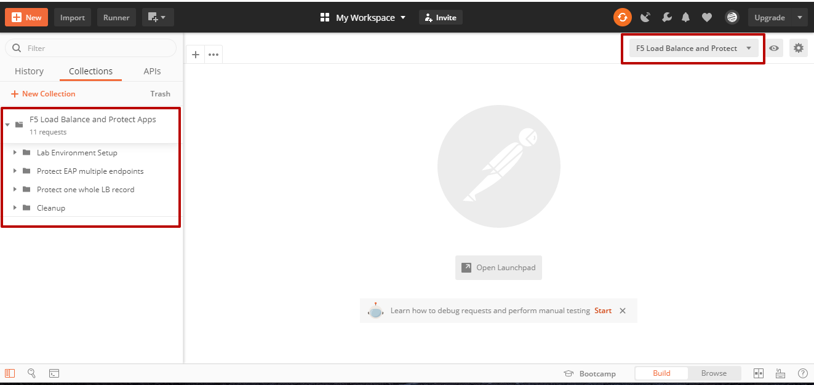
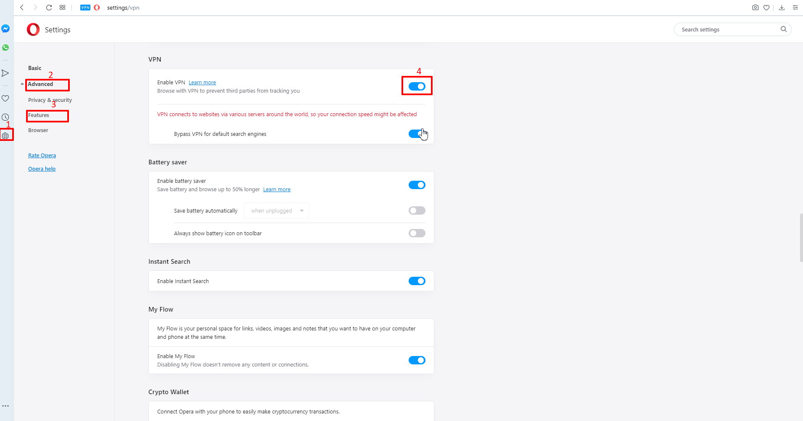
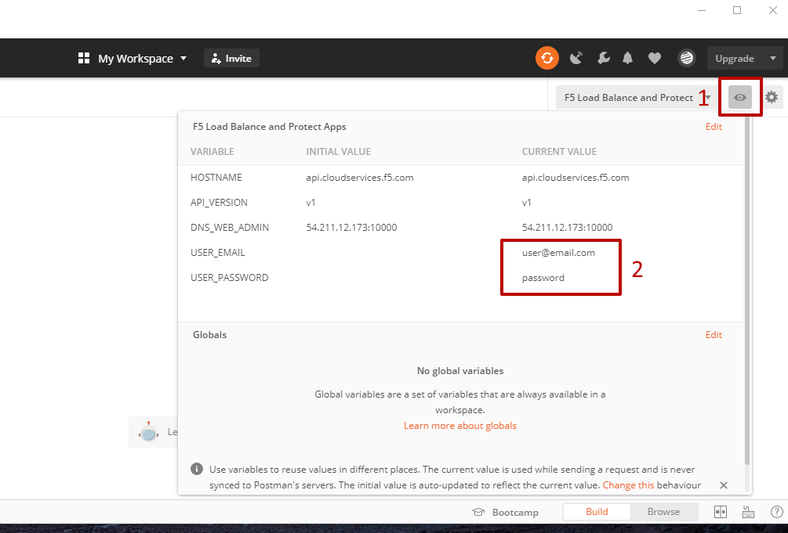
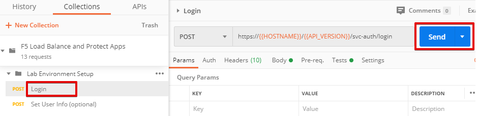
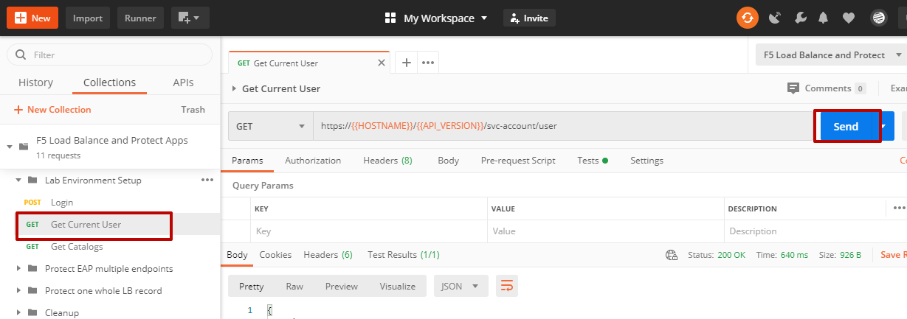
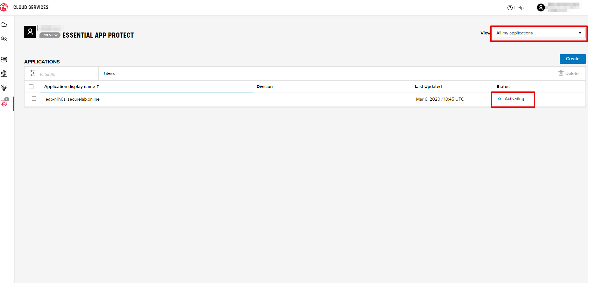
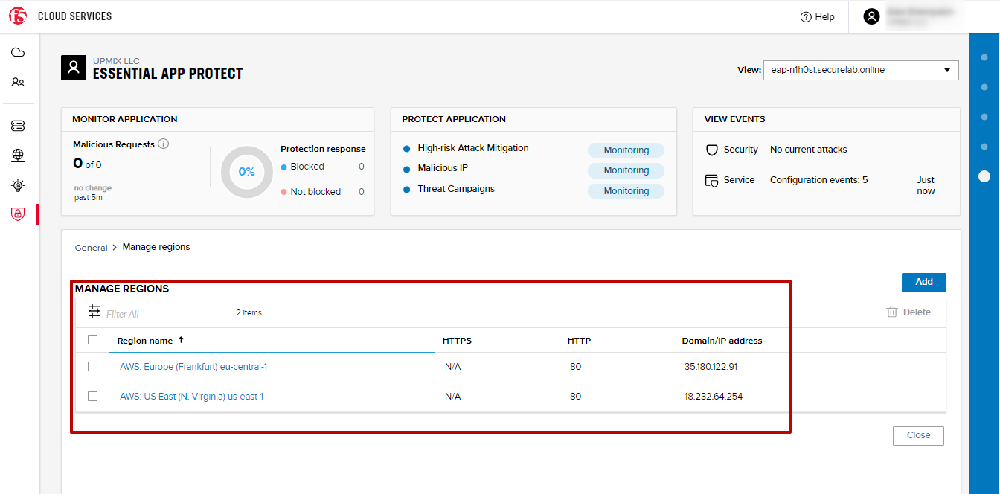
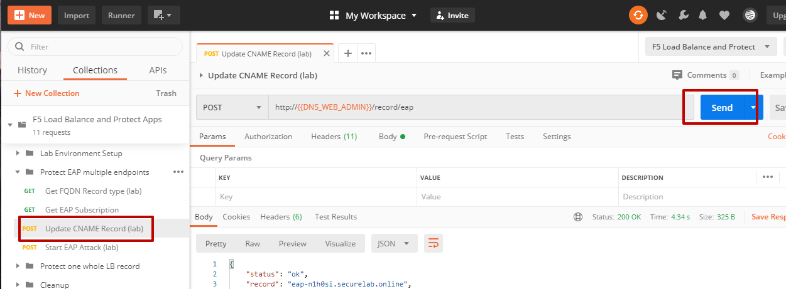
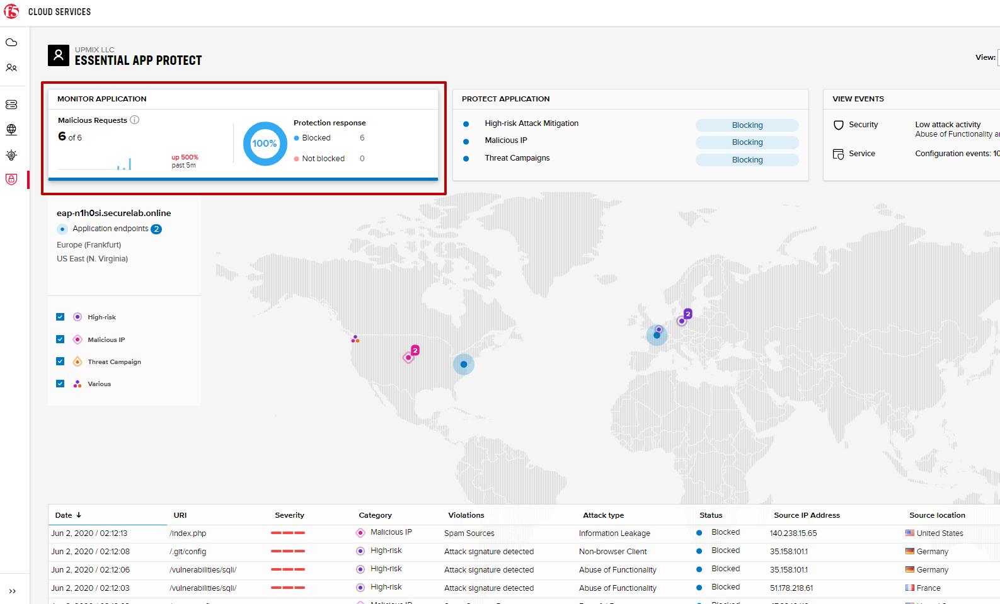
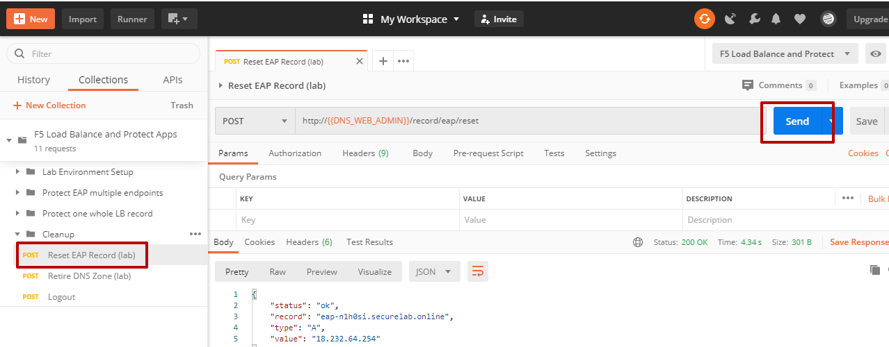

LAB: F5 Load Balance and Protect Apps
===========================================

.. contents:: Table of Contents

Pre-Requisites
###############

- Any modern browser: for working with the UI (and this document)
- Postman: for working with the API of the F5 Cloud Services
- Opera browser: for simulating geo-location specific traffic

**IMPORTANT NOTE**: If you originally signed up for F5 Cloud Services through a Limited User invitation (such as an email invite from another lab or from a different account owner), then it is possible that you haven't yet completed a full registration.

You can quickly tell if you have a full account by looking at your account(s) in the `F5 Cloud Services Portal <https://portal.cloudservices.f5.com/>`_. If you do not see any "Accounts you own:" and only see "Accounts you've been granted access to" as a **"Limited User"**, then you will need to create a full account & update user info before you can proceed with this lab. You can do so in the step 3(c) below via the F5 Cloud Services API using the Postman request titled **"Set User Info (optional)"**, the details of which are outlined below after the Login.

Lab Environment Overview
###############################

1. APIs and Services
*********************

This Lab utilizes a *Lab Service API*, which was custom-built just for executing this lab:

* **Lab service API**: facilitates auxiliary functions for the lab only: creating DNS entries, sending targeted requests & traffic to the apps/services, etc.

Lab Environment Setup
###############################

1. F5 Cloud Services Portal
***************************

`a)` Login

In order to use F5 Essential App Protect and DNS Load Balancer cloud services, you need access to F5 Cloud Services and be logged in with a valid user account. If you need to sign up, or if you already have one, proceed to the `F5 Cloud Services portal <http://bit.ly/f5csreg>`_.

Once you've logged in with an account, you will be using the user name and password values in the lab to authenticate with the F5 Cloud Services and the API.

`b)` Subscribe to Catalogs

In order to access specific F5 Cloud Services, you need to subscribe to the corresponding service catalogs. The focus of this lab is on F5 Essential App Protect and DNS Load Balancer services, so you will need to subscribe to them. At the time of the writing of this lab you can take advantage of a 15-day free trial offer to work with F5 Essential App Protect service -- no payment method required!

   `1.` Click on the **Your F5 Cloud** tab in the left navigation panel and you will see the available service catalogs, as well as services you have subscribed to, if any. For this lab you will need to subscribe to **DNS Load Balancer** and **Essential App Protect services**.

   .. figure:: _figures/0_2.png

   `2.` You can subscribe to the service, or start a free trial (if available). For full subscription you will need to provide payment information in the **Accounts** - **Payments** section, by adding a credit card, or alternatively subscribing through AWS Marketplace.

   .. figure:: _figures/0_3.png

   After successfully subscribing, your services will appear in the **Your F5 Cloud** tab. You will also see their current status.

   .. figure:: _figures/0_4.png
   
   If you need to check your payment information, it is available in the **Accounts** tab, **Payment** section.
   
   .. figure:: _figures/0_22.png

2. Postman Configuration
**************************

`a)` Download Postman `here <http://bit.ly/309wSLl>`_, open it, create a Postman account if you don’t have one and choose to do so, and sign in.

`b)` Import collection and environment JSON files from the `Git repo for this lab <https://bit.ly/3eb8yhN>`_: 

- collection: https://bit.ly/2ZavYj2
- environment: https://bit.ly/3ffTcd2

.. figure:: _figures/0_23.png

.. figure:: _figures/0_24.png

Repeat the steps above for the environment JSON file. You will now see the imported collection (left side) with calls in several categories, as well as environment variables (top right) used to store and pass data between Postman and the API.

You are now ready to interface with the F5 Cloud Services using Postman.

3. Opera Browser with VPN to Test Geolocation
**************************

In order to test geo-proximity rules, you can use your own VPN service (if you have one), remote desktop to a VM in a different region (if you have one), or alternatively use the Opera browser. 

Open the Opera browser, click **Settings, Advanced, Features** and then **Enable VPN**.

Protect Essential App Protect Multiple Endpoints
#####################

The following diagram captures the core components of this chapter:

 .. figure:: _figures/chart_1_0.png

1. Get Fully Qualified Domain Name (FQDN)
************************************************************************

To protect mulpitple endpoints (North America and Europe), we, first of all, will need to create the Essential App Protect instance in the F5 Cloud Services portal using FQDN. Use Postman and follow the steps below to get FQDN from the Lab service API.

`a)` Open the “F5 Load Balance and Protect Apps” environment variables by clicking the “Environment Quick Look”, click into the field of the corresponding variable, and type the value of user email in the variable “USER_EMAIL” (click **Enter** after typing the values). Do the same for the “USER_PASSWORD”.

`b)` Select the **Login** request in the sidebar to login to your F5 Cloud Services profile and click **Send** to get the authorization token. More detailed information on this API request can be found `here <https://bit.ly/2ZauPbi>`_.

A successful login will result in Postman returning the tokens from the API, shown in the response body below:

.. figure:: _figures/0_9.png

These tokens are then stored for subsequent calls using a function inside Postman to set environment variables. You can see the test function in the “Tests” tab:

.. figure:: _figures/0_10.png

**IMPORTANT NOTE**: If any of the subsequent Postman calls return a blank response or **"status": "unauthorized"** response (see the screenshot below), it means that your user token has expired and you simply need to re-login. To do that you just need to re-send the **Login** request using Postman to capture a new token.

.. figure:: _figures/0_11.png 

`c)` OPTIONAL (existing F5 cloud service accounts only): **Set User Info (optional)**

**IMPORTANT NOTE**: You can skip this step and proceed to step (d) if you have just created a brand new account.

   However, if you were previously signed up for F5 Cloud Services through a Limited User invitation (such as an email invite from another lab or from a different account    owner), then it is possible that you haven't yet completed a full registration. You can quickly tell if you have by looking at your account(s) in the F5 Cloud Services Portal If you do not see any "Accounts you own:" and only see "Accounts you've been granted access to" as a "Limited User", then you need to create a full account & update user info before you can proceed with this lab.
   
You can do this by running the following **Set User Info (optional)** API call, after you've updated the Body of the request with your own organization & address information:

.. figure:: _figures/0_12.png

The response returns the following detail, including your own organization account ID (id):

.. figure:: _figures/0_13.jpg

More information on this API request can be found `here <https://bit.ly/2Z9mswr>`_. 

At this point you should be a full user with an "Owned Account" and a primary organization account id, which can also be confirmed in the F5 Cloud Services Portal in the drop-down under your user name (top right), where you should see "Accounts you own:" and the Organization Account you created with **"Owner"** defined.

`d)` Retrieve User ID & Account ID

Select the **Get Current User** request and click **Send** to retrieve User ID and Account ID to be used in the further requests.

The response returns the following detail:

The retrieved User ID and Account ID are then stored for subsequent calls.

.. figure:: _figures/0_16.png

More detailed information on this API request can be found `here <https://bit.ly/38DsMj5>`_. 

`e)` Retrieve information on available catalogs and their IDs

Select the **Get Catalogs** request and click **Send** to retrieve the data about the available Catalogs and their IDs.

.. figure:: _figures/0_17.png

You can see the available catalogs:

The retrieved IDs are then stored for subsequent calls using a function inside Postman that sets environment variables. You can see the test function in the "Tests" tab of the request:

.. figure:: _figures/0_19.png

More detailed information on this API call can be found `here <https://bit.ly/3iJhTR5>`_. 

`f)` Let’s now retrieve FQDN with the **Get FQDN Record type (lab)** API call. Click **Send**. This call will pass your “ACCESS_TOKEN” in the header of the request to the Labs API in order to get a record that will be used to create F5 Essential App Protect instance in the F5 Cloud Services portal. The request is as follows:

.. figure:: _figures/0_20.png

The response will return your record name, its status, current type and value.

.. figure:: _figures/1_2.png

Note that at this stage our test application is using an A-record to route traffic that's going to the FQDN to the IP of the app server. During the lab we will update this DNS record to a CNAME generated during the Essential App Protect instance setup, so that the app traffic will be directed to Essential App Protect instance first, and then the "scrubbed" traffic will be directed to our app IP (or FQDN) depending on the configuration.

When this request completes successfully the value of the FQDN Record will be captured as a variable:

**IMPORTANT NOTE**: Make note of this FQDN record; we will use it many times throughout the lab, and for creating the Essential App Protect service in the F5 Cloud Services portal, as well as throughout the lab as the domain name for your test application.

2. Create Essential App Protect Application
************************************************************************

`a)` In order to create the Essential App Protect service, we need the FQDN Record info from a previously run API call. You can retrieve it by opening the **Get FQDN Record type (lab)** request in Postman and copying the value of the "record" key in the response.

.. figure:: _figures/1_2.png

`b)` Go to the F5 Cloud Services portal, open the **Essential App Protect** tab and click **Start protecting your app**.

.. figure:: _figures/1_3.png

`c)` Paste the record name you copied in step 2.a) above into **"Fully Qualified Domain Name (FQDN)"** field. The **"Name this application"** field will auto-populate; keep this value as-is for simplicity. The **"Add a description"** field is optional. Click **Save & Continue**.

.. figure:: _figures/1_3_1.png

`d)` Essential App Protect does an FQDN lookup to retrieve the corresponding IP of the FQDN record, and will gather info on the location and geo-proximity of the nearest cloud region, and will display these as recommendations as to where to deploy the EAP instance.

At this point, some users may want to select a different value in the drop-down for the EAP Region, which you can update/change at any time in the EAP instance settings after the instance setup.

**NOTE**: If after a minute you don't see the endpoint info, hit refresh and click "Complete Setup" to return to this step / see the info.

Click **Save & Continue**.

.. figure:: _figures/1_4.png

Note the info on the IP, City, State, and the Cloud Provider used by our test application. It also shows the region used by the cloud provider derived from the FQDN/IP information. As you can see in the screenshot, the example test app endpoint is located in North America, US East (N. Virginia) and is deployed on Amazon AWS. Note that the default configuration will be to route the traffic that's hitting the EAP instance to the identified IP address of the application endpoint.

`e)` You can now provide an SSL/TLS certificate if you want to. However, for the lab at this point we will skip uploading the certificate and for now will only select "Enable HTTP Listener" with Port 80, and uncheck "Enable HTTPS Listener", then click **Save & Continue**.

.. figure:: _figures/1_5.png

`f)` Accept the defaults for all of the app protect features on the next screen and click **Save & Continue**. In case you need to update this property in the future, you can do so later in the **PROTECT APPLICATION** section.

`g)` Here take note of the **CNAME** value that's generated for your Essential App Protect instance. This value will be used to update our application's DNS record by changing it from an IP address to a CNAME. You should probably copy + paste it to a temporary document, but we'll also retrieve it through the UI and an API call later. Click **Done** and Essential App Protect service will be created and should be ready for use shortly.

.. figure:: _figures/1_7.png

**IMPORTANT**: Note that this process may take some time. You can check the status in the **All my applications** option of the dropdown menu:

3. Add New Endpoint
************************************************************************

As you can see, for now we've got only one endpoint located in North America, US East (N. Virginia) and deployed on Amazon AWS. But our applicatoin is serving a global audience, so let's add the second endpoint located in Europe for European users.

`a)` Go to the F5 Cloud Services Portal, the **Essential App Protect** service and move on to the **PROTECT APPLICATION** card. There, in the **General** tab, select **Manage regions**.

.. figure:: _figures/1_8.png

`b)` Hit **Add**: 

.. figure:: _figures/1_9.png

`c)` Configure the Europe region. First, select the region from the drop-down menu and then select **IP Address** as endpoint type. Fill in the **IP Address** field with **35.180.122.91** and **Enable HTTP** port, **80**. **Save** the settings.     

.. figure:: _figures/1_11.png

As a result, we'll see both of your app's endpoints:

IP Endpoints will also be updated in the **General** tab of the **PROTECT APPLICATION** card. 

.. figure:: _figures/1_13.png

`d)` Now let's see our app's enpoints on the map. Go to the **MONITOR APPLICATION** card where you can see that both endpoints are shown on the map - one in North America, another in Europe.

.. figure:: _figures/1_14.png

4. Update DNS Settings Using CNAME
************************************************************************

Now that your Essential App Protect instance is created with two endpoints, we will update the DNS settings of our test app by switching the A-record (that previously pointed to the IP address of the app server) to the newly-created CNAME provided by the EAP setup. This way we will start routing all of the traffic that resolves the app's DNS record to Essential App Protect. Let's do that in the following steps!

a) Let's go to Postman and use the **Get EAP Subscription** request to get the "subscription_id" and "CNAME" using your "ACCESS_TOKEN".

.. figure:: _figures/1_14_1.png

The response will return all information on your instance which we have created via UI:

**TODO screenshot of the response**

The retrieved CNAME will be stored as a variable and will also be used to update the DNS settings:

**TODO screenshot of the response**

More detailed information on this API request can be found `here <https://bit.ly/31XJTuz>`_. 

`b)` Now send the **Update CNAME Record (lab)** request to update our test app's DNS Settings with the generated CNAME, which we captured in the UI earlier, and just now in the previous step using the API request as well:

The response will show the updated type ("CNAME") and value:

**TODO screenshot of the response**

`c)` Test CNAME change via the F5 Cloud Services portal 

Return to the F5 Cloud Services portal, open the **Essential App Protect** tab, select your app from the dropdown menu and click **PROTECT APPLICATION**. Then open the **DNS Settings** tab and click **Test updated DNS**.

.. figure:: _figures/1_14_3.png

You should see "Success" indicating that our DNS updates succeeded!

5. Test Geolocation with Opera Browser
************************************************************************

Now let’s test the geolocation using the Opera browser. As you remember, we've got two endpoints for users in North America and Europe, so we'll test those two locations.

`a)` Open the Opera browser, click **VPN** and first select **Americas**. This will simulate your entering BuyTime Website from America. Then copy FQDN name in Load balanced record properties and paste into the browser. You will get to that IP endpoint which is located in North America, US East (N. Virginia).

.. figure:: _figures/1_15.png

`b)` And now select **Europe** in **VPN** of the Opera browser and **Reload** the page. You will get to the European IP endpoint, which means that European users are directed to that IP Endpoint.

.. figure:: _figures/1_16.png

6. Execute an Illegal Filetype attack
************************************************************************

.. figure:: _figures/1_17.png
.. figure:: _figures/1_18.png

.. figure:: _figures/1_21.png
.. figure:: _figures/1_22.png

7. Enable all protection and simulate more attacks
************************************************************************

.. figure:: _figures/1_23.png
.. figure:: _figures/1_25.png
.. figure:: _figures/1_26.png

.. figure:: _figures/1_28.png

Protect one whole LB record
#####################

The following diagram captures the core components of this chapter:

.. figure:: _figures/chart_3_0.png

1. Get Zone
************************************************************************

** TODO: update screenshot **

.. figure:: _figures/3_2.png

2. Create DNS LB App
************************************************************************

.. figure:: _figures/3_4.png
.. figure:: _figures/3_5.png

4. Add LB endpoints
************************************************************************

.. figure:: _figures/3_6.png
.. figure:: _figures/3_7.png
.. figure:: _figures/3_8.png
.. figure:: _figures/3_9.png

5. Configure LB Pool
************************************************************************

.. figure:: _figures/3_12.png
.. figure:: _figures/3_13.png
.. figure:: _figures/3_14.png

.. figure:: _figures/3_16.png
.. figure:: _figures/3_18.png

6. Configure Load Balanced Records
************************************************************************

.. figure:: _figures/3_19.png
.. figure:: _figures/3_20.png
.. figure:: _figures/3_21.png

7. Update EAP App
************************************************************************

.. figure:: _figures/3_41.png
.. figure:: _figures/3_42.png
.. figure:: _figures/3_43.png
.. figure:: _figures/3_44.png

8. Simulate SQL injection attack
************************************************************************

Open link in the browser and click login
username: ' OR 1=1 --'
password: 'any value'

.. figure:: _figures/3_46.png
.. figure:: _figures/3_47.png

Cleanup
#####################

.. figure:: _figures/4_2.png

