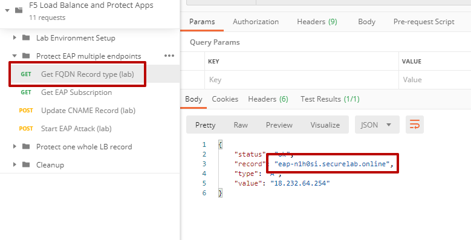
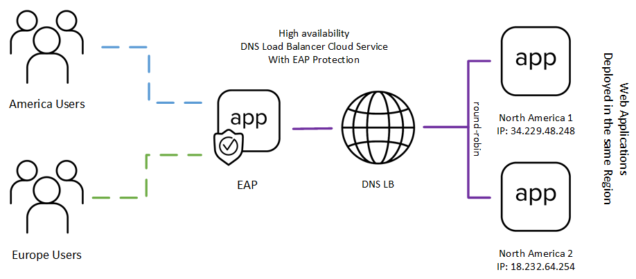
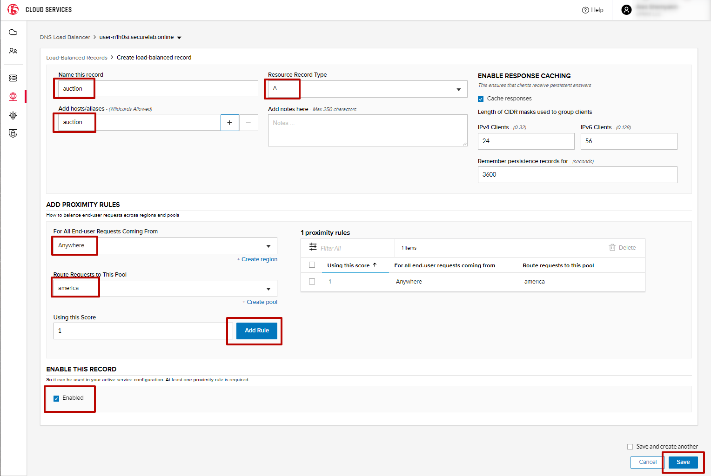

LAB: F5 Load Balance and Protect Apps
===========================================

.. contents:: Table of Contents

Pre-Requisites
###############

- Any modern browser: for working with the UI (and this document)
- Postman: for working with the API of the F5 Cloud Services

**IMPORTANT NOTE**: If you originally signed up for F5 Cloud Services through a Limited User invitation (such as an email invite from another lab or from a different account owner), then it is possible that you haven't yet completed a full registration.

You can quickly tell if you have a full account by looking at your account(s) in the `F5 Cloud Services Portal <https://portal.cloudservices.f5.com/>`_. If you do now see any "Accounts you own:" and only see "Accounts you've been granted access to" as a **"Limited User"**, then you will need to create a full account & update user info before you can proceed with this lab. You can do so in the step 3(c) below via the F5 Cloud Services API using the Postman request titled "Set User Info (optional)", the details of which are outlined below after the Login.

Lab Environment Overview
###############################

1. APIs and Services
*********************

This Lab utilizes a *Lab Service API*, which was custom-built just for executing this lab:

* **Lab service API**: facilitates auxiliary functions for the lab only: creating DNS entries, sending targeted requests & traffic to the apps/services, etc.

Lab Environment Setup
###############################

1. F5 Cloud Services Portal
***************************

`a)` Login

In order to use F5 Essential App Protect service, you need access to F5 Cloud Services and be logged in with a valid user account. If you need to sign up, or if you already have one, proceed to the `F5 Cloud Services portal <http://bit.ly/f5csreg>`_.

.. figure:: _figures/0_1.png

Once you've logged in with an account, you will be using the user name and password values in the lab to authenticate with the F5 Cloud Services and the API.

`b)` Subscribe to Catalogs TODO: andd DNSLB

In order to access specific F5 Cloud Services, you need to subscribe to the corresponding service catalogs. The focus of this lab is on F5 Essential App Protect service, so you will need to subscribe to it. At the time of writing you can take advancate of a 10-day free trial offer to work with this service -- no payment method required!

   `1.` Click on the **Your F5 Cloud** tab in the left navigation panel and you will see the available service catalogs, as well as services you have subscribed to, if any. For this lab you will need to subscribe to **Essential App Protect** services.

   .. figure:: _figures/0_2.png

   `2.` You can subscribe to the service, or start a free trial (if available). For full subscription you will need to provide payment information in the **Accounts** - **Payments** section, by adding a credit card, or alternatively subscribing through AWS Marketplace.

   .. figure:: _figures/0_3.png

   After successfully subscribing, your services will appear in the **Your F5 Cloud** tab. You will also see their current status.

   .. figure:: _figures/0_4.png

2. Postman Configuration
**************************

`a)` Download Postman `here <http://bit.ly/309wSLl>`_, open it, create a Postman account if you don’t have one and choose to do so, and sign in.

`b)` Clone or download and extract the repository

.. figure:: _figures/0_5.png

`c)` Download collection **{{ TODO COLLECTION_NAME }}.postman_collection.json** and environment **{{ TODO COLLECTION_NAME }}.postman_environment.json** for Postman `here <https://bit.ly/2PK0z1J>`_. Import them to your Postman.

.. figure:: _figures/0_6.jpg

You will now see your collection (left side) with calls in several categories, as well as environment variables (top right).

TODO: image

.. figure:: _figures/0_7.png

You are now ready to interface with the F5 Cloud Services using Postman.

Protect EAP multiple endpoints
#####################

The following diagram captures the core components of this chapter:

 .. figure:: _figures/chart_1_0.png

1. Get FQDN Record
************************************************************************

** TODO: replace **

.. figure:: _figures/1_1.png

** TODO: replace **

2. Create EAP App
************************************************************************

.. figure:: _figures/1_3.png

.. figure:: _figures/1_4.png

.. figure:: _figures/1_6.png
.. figure:: _figures/1_7.png

3. Add new endpoint
************************************************************************

.. figure:: _figures/1_8.png

Configure Europe region. Add endpoint in France
** TODO: replace **

.. figure:: _figures/1_11.png

As a result we should have:

.. figure:: _figures/1_12.png
.. figure:: _figures/1_13.png

On the map

.. figure:: _figures/1_14.png

4. Update CNAME
************************************************************************

** TODO: replace **

.. figure:: _figures/1_14_1.png
.. figure:: _figures/1_14_2.png
.. figure:: _figures/1_14_3.png

5. Test geolocation with opera browser
************************************************************************

.. figure:: _figures/1_15.png
.. figure:: _figures/1_16.png

6. Execute an Illegal Filetype attack
************************************************************************

.. figure:: _figures/1_19.png
.. figure:: _figures/1_20.png

.. figure:: _figures/1_22.png

7. Enable all protection and simulate more attacks
************************************************************************

.. figure:: _figures/1_25.png
.. figure:: _figures/1_26.png

** TODO: replace (remove 1 endpoint) **

.. figure:: _figures/1_27.png
.. figure:: _figures/1_28.png

Protect one whole LB record
#####################

The following diagram captures the core components of this chapter:

1. Get Zone
************************************************************************

** TODO: update screenshot **

.. figure:: _figures/3_2.png

2. Create DNS LB App
************************************************************************

.. figure:: _figures/3_3.png

.. figure:: _figures/3_5.png

4. Add LB endpoints
************************************************************************

.. figure:: _figures/3_7.png
.. figure:: _figures/3_8.png
.. figure:: _figures/3_9.png
.. figure:: _figures/3_10.png

5. Configure LB Pool
************************************************************************

.. figure:: _figures/3_14.png
.. figure:: _figures/3_15.png
.. figure:: _figures/3_16.png
.. figure:: _figures/3_18.png

6. Configure Load Balanced Records
************************************************************************

.. figure:: _figures/3_21.png

7. Update EAP App
************************************************************************

.. figure:: _figures/3_40.png

.. figure:: _figures/3_43.png
.. figure:: _figures/3_44.png
.. figure:: _figures/3_45.png

8. Test Round Robin in Opera Browser
************************************************************************

TODO: add screens

9. Simulate SQL injection attack
************************************************************************

TODO: add screens

DNSLB – protect each of 2 Endpoints
#####################

The following diagram captures the core components of this chapter:

 .. figure:: _figures/chart_2_0.png

1. Update EAP Application with API
************************************************************************

TODO: replace screenshots
Update our existing EAP application

.. figure:: _figures/2_30.png
.. figure:: _figures/2_31.png

Create a second Application for Europe

.. figure:: _figures/2_32.png
.. figure:: _figures/2_33.png

2. Configure DNSLB Pools
************************************************************************

.. figure:: _figures/2_34.png
.. figure:: _figures/2_35.png
.. figure:: _figures/2_36.png
.. figure:: _figures/2_37.png
.. figure:: _figures/2_38.png
.. figure:: _figures/2_39.png
.. figure:: _figures/2_40.png
.. figure:: _figures/2_41.png
.. figure:: _figures/2_42.png
.. figure:: _figures/2_43.png
.. figure:: _figures/2_44.png
.. figure:: _figures/2_45.png

5. Configure DNSLB Load Balanced Record
************************************************************************

.. figure:: _figures/2_46.png
.. figure:: _figures/2_47.png
.. figure:: _figures/2_48.png
.. figure:: _figures/2_49.png
.. figure:: _figures/2_50.png
.. figure:: _figures/2_51.png
.. figure:: _figures/2_52.png

6. Test GEO LB and attack
************************************************************************

TODO: add screens

7. Cleanup
************************************************************************

TODO: add screens

